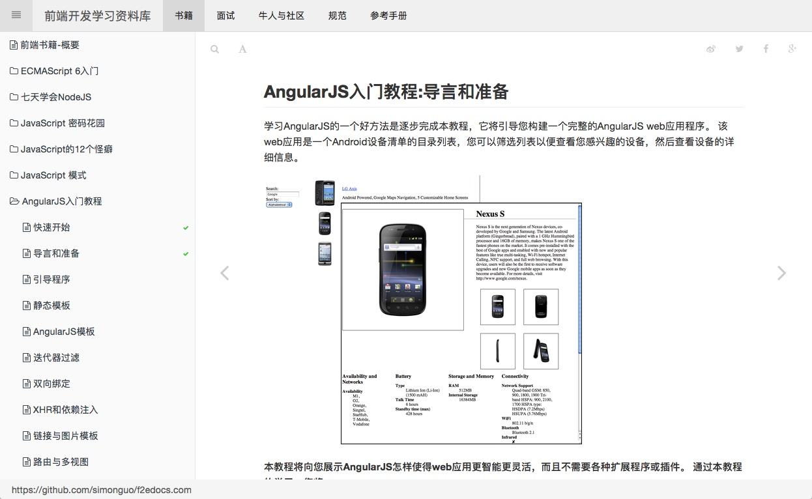

# 前端开发-学习资料库

包含前端技术参考手册，前端编码规范，前端博客及社区，前端面试题，以及整理前端开源的一些开源书籍。

[http://f2edocs.com](http://f2edocs.com)

持续更新中...

## 参考、使用的项目
- [ECMAScript6编码规范](https://github.com/gf-rd/es6-coding-style)
- [w3school](http://www.w3school.com.cn/index.html)
- [ECMAScript 6入门](https://github.com/ruanyf/es6tutorial/)
- [七天学会NodeJS](https://github.com/nqdeng/7-days-nodejs)
- [JavaScript 秘密花园](https://github.com/BonsaiDen/JavaScript-Garden)
- [CSS参考手册](https://github.com/doyoe/css-handbook)
- [12 JavaScript quirks](http://www.2ality.com/2013/04/12quirks.html)
